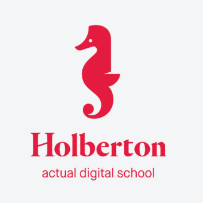

# 0-Day

This repository contains files written for Vagrant, Emacs, and vi projects
completed for my first day, zero-day, at Holberton School.

## Author :Patrick MICHEL:

* __Patrick MICHEL__ <[Patrick MICHEL](https://github.com/Pmichel74)>

## Acknoledgements :pray:

All work contained in this project was completed as part of the curriculum for Holberton
School. Holberton School is a campus-based full-stack software engineering program that
prepares students for careers in the tech industry using project-based peer learning. For
more information, visit [this link](https://www.holbertonschool.com/).

  

